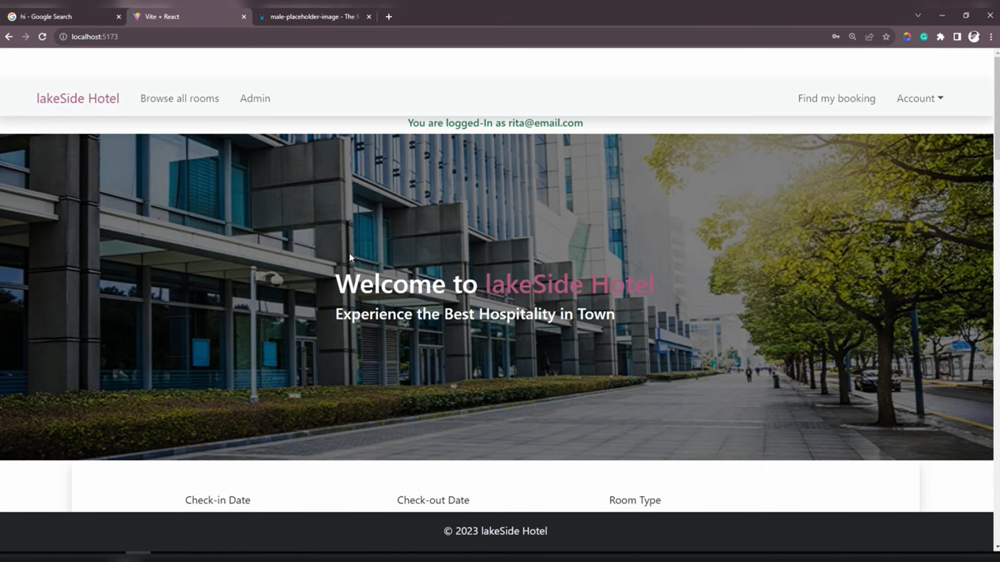
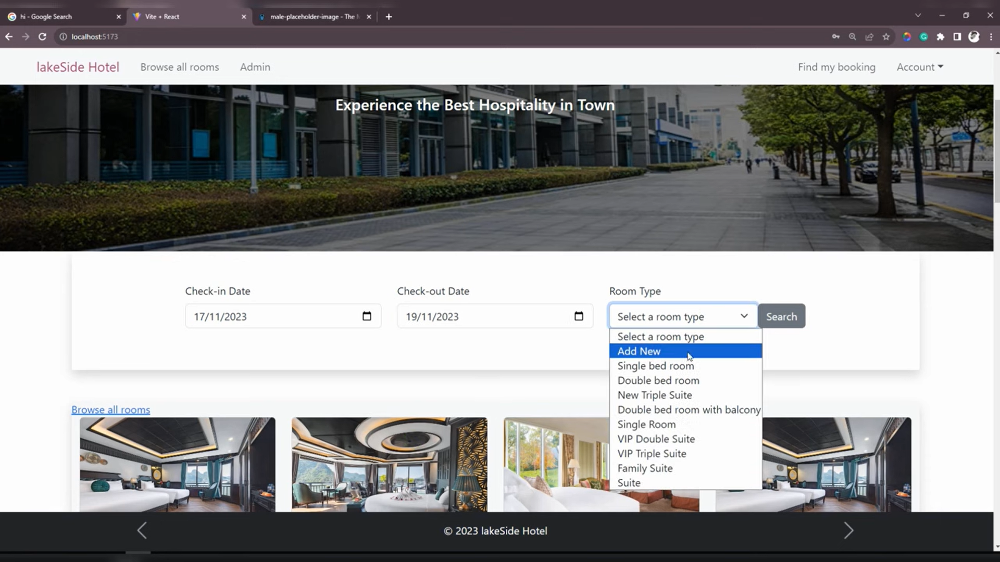
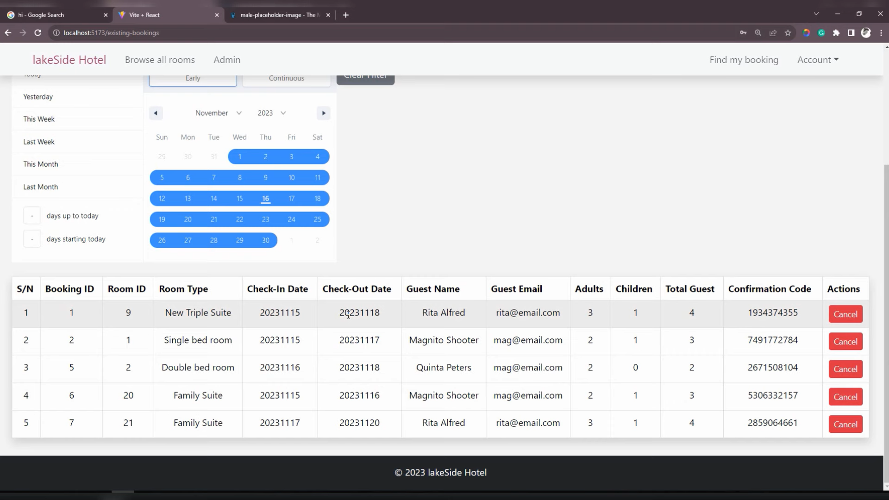
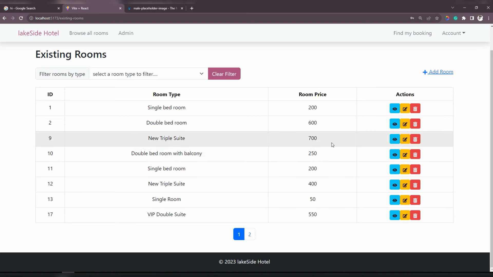

# Lakeside Hotel Management and Booking System

Welcome to the Lakeside Hotel Management and Booking System! This project is a comprehensive solution for managing hotel bookings with features such as hotel filtering, admin and customer login, checkout, and payment options. It is built using the MVC architecture with Spring Boot for the backend and React.js for the frontend.

## 🚀 Getting Started

### Prerequisites
- **Java**: 17 or higher
- **Node.js**: 14 or higher and npm
- **MySQL**: or your preferred database system

### Setup Instructions

1. **Clone the Repository:**

    ```bash
    git clone https://github.com/YourUsername/LakesideHotelManagement.git
    cd LakesideHotelManagement
    ```

2. **Backend Setup:**

    - Navigate to the `backend` directory:
      ```bash
      cd backend
      ```

    - Configure your MySQL database and update the `application.properties` file with your database credentials.

    - Compile the Java code using Maven:
      ```bash
      ./mvnw clean install
      ```

    - Run the Spring Boot application:
      ```bash
      ./mvnw spring-boot:run
      ```

3. **Frontend Setup:**

    - Navigate to the `frontend` directory:
      ```bash
      cd ../frontend
      ```

    - Install the dependencies using npm:
      ```bash
      npm install
      ```

    - Run the React application with Vite:
      ```bash
      npm run dev
      ```

## 📦 Features

- **User Registration & Login**
  - Separate login for Admin and Customers.
- **Hotel Booking**
  - Browse and book hotels with various filters (location, price, rating, etc.).
- **Admin Panel**
  - Manage hotel listings, bookings, and user accounts.
- **Customer Dashboard**
  - View and manage your bookings.
- **Checkout & Payment**
  - Secure checkout process with payment integration.

## 🌐 Technologies Used

- **Backend:** Java, Spring Boot, JDBC
- **Frontend:** React.js, Redux, Vite
- **Database:** MySQL

## 📸 Screenshots

-  User Dashboard
  
- Hotel Booking Page
  
-  Admin Panel
  
-  Room Availability
  

## 📄 License

This project is licensed under the BSD-2-Clause License. See the [LICENSE](LICENSE) file for details.

## 🎉 Acknowledgements

Special thanks to all the contributors and open-source libraries that made this project possible.

---
